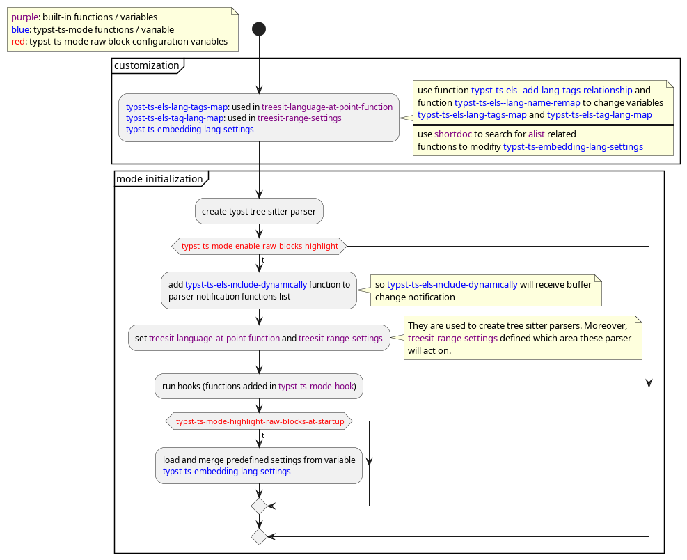
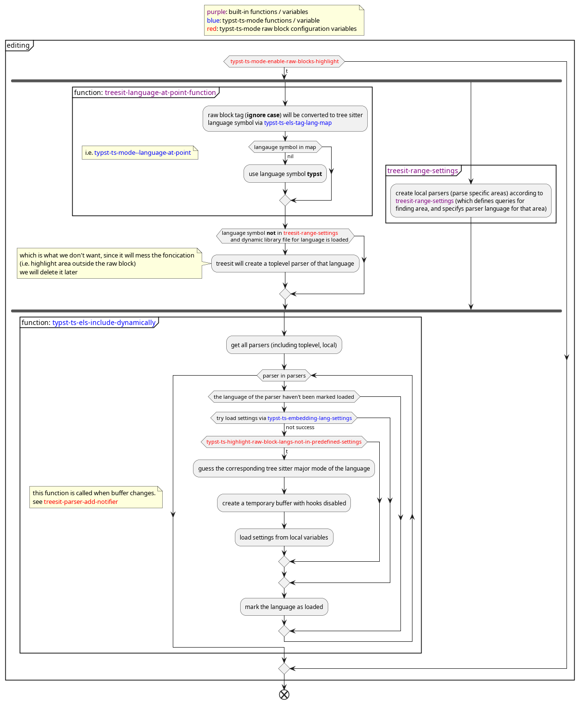

# Raw Block Highlighting

## Customization Option
1. `typst-ts-mode-enable-raw-blocks-highlight`  
2. `typst-ts-mode-highlight-raw-blocks-at-startup`  
Due to the lazy fontification feature of `treesit`, raw blocks won't be 
highlighted at the startup by default. Set it to `t` to enable this feature.
3. `typst-ts-highlight-raw-block-langs-not-in-predefined-settings`

## Mechanism

  
  

## Customize
1. add/modify raw block language tags/language relationship.  
   for example   
   ~~~typst
   ```newtag
   ```
   ~~~
   -> customize `typst-ts-els-lang-tags-map` and `typst-ts-els-tag-lang-map`   
   -> use `typst-ts-els--add-lang-tags-relationship` helper function.  
2. remap existing raw block language to new raw block language  
   like `c++` -> `cpp`  
   -> customize `typst-ts-els-lang-tags-map` and `typst-ts-els-tag-lang-map`  
   -> use `typst-ts-els--lang-name-remap` helper function.  
   
3. add new pre-configured language settings  
   -> customsize `typst-ts-embedding-lang-settings`  
   -> use `shortdoc` command to search for `alist` related functions to modify it  
   -> use `typst-ts-embedding-lang-settings-test` function to test your configuration.  
   settings specification: see `typst-ts-embedding-lang-settings`.  
   explain:  
   1. key: language name: which is the name specified in your tree sitter dynamic library. Or you can find it by:   
      1. go to the `<xxx>-ts-mode` major mode function  
      2. find `(treesit-parser-create 'cpp)`. So `cpp` is the language name, instead
      of the `c++`  
   2. `:feature`: the source file name without extension of the `<xxx>-ts-mode`. Or
      you can find it in variable `features`  
   3. `:font-lock`: go to the source file, find `treesit-font-lock-settings`  
   4. `:indentation`: go to the source file, find `treesit-simple-indent-rules`  
   5. `:ts-feature-list`: go to the source file, find `treesit-font-lock-feature-list`  

## Current Limitations

1. update raw block language will not delete the old local parser  
   -> this will cause error of raw block raw block highlighting.
   -> you need to delete the whole raw block to remove the local parser  
   -> this is due to the behavior of `treesit--update-ranges-local`  
   -> currently haven't thought out good way to handle it  
   
2. typst raw block cannot live in typst raw block  
For example:
~~~typst
```typ
= a  // highlight currectly
```typ
= b // cannot highlight
```
```
~~~
This is probably due to the Typst tree sitter parser.

3. Although we also load the indentation configurations, many language in raw block
still cannot do indentation. Some languages like `rust`(`rust-ts-mode`) works.
